  <picture>
    <source media="(max-width: 760px) and (prefers-color-scheme: dark)" srcset="./assets/hero/builder-profile-v2-mobile-dark.svg">
    <source media="(max-width: 760px)" srcset="./assets/hero/builder-profile-v2-mobile-light.svg">
    <source media="(prefers-color-scheme: dark)" srcset="./assets/hero/builder-profile-v2-dark.svg">
    <source media="(prefers-color-scheme: light)" srcset="./assets/hero/builder-profile-v2-light.svg">
    
  </picture>

  <a href="https://github.com/ahmed-mohamed-sh"><strong>View Portfolio</strong></a>

## Hey, I'm Ahmed

I'm a **Full-Stack & AI Security Engineer** based in Egypt. I work across **web application penetration testing, AI-powered security tools, full-stack development, and machine learning**, bridging the gap between innovative engineering and robust security.

I enjoy taking projects from an early idea to a working release: defining the architecture, building the core system, identifying vulnerabilities, and securing the final product.

## What I Build

- **AI-powered Security Tools:** integrating AI agents (like LangChain and Groq) into security platforms for automated vulnerability detection, analysis, and reporting.
- **Web App Penetration Testing:** analyzing systems, finding exploits, and securing web applications using industry standards like the OWASP Top 10.
- **Full-Stack Engineering:** building scalable, performant applications from product direction and interface design to backend systems, APIs, and databases.
- **Machine Learning & Data Science:** designing clustering algorithms, predictive models, and RAG chatbots to extract insights and automate workflows.

## Selected Work

| Project | What I built | My role · Current state |
| --- | --- | --- |
| [**VulnScope**](https://github.com/ahmed-mohamed-sh/VulnScope) | AI-powered web application penetration testing platform with rule-based detection, exploitation engine, and AI reporting. | Creator · Lead Developer Active Development |
| [**MedStudy AI**](https://github.com/ahmed-mohamed-sh/MedStudy-AI) | RAG-powered chatbot designed to assist medical students using FAISS and Groq. | Developer Completed |
| [**ML Ensemble Platform**](https://github.com/ahmed-mohamed-sh/ML-Ensemble) | Platform for running and evaluating Voting, Bagging, and Boosting models through a clean web UI. | Developer Completed |
| [**Patient Risk Stratifier**](https://github.com/ahmed-mohamed-sh/Patient-Risk-Stratifier) | GMM clustering and RBF Network system for patient risk prediction achieving 84% accuracy. | Developer Completed |
| [**E-commerce Sales Analytics**](https://github.com/ahmed-mohamed-sh/E-commerce-Analytics) | End-to-end data platform with an ETL pipeline, PostgreSQL analytics, and a Power BI dashboard. | Data Engineer Completed |

## Selected Highlights

- **Fortinet NSE:** Certified in Security & Networking.
- **NTI Creativa Cyber Security Track:** Specialized training in Penetration Testing & Network Security.
- **CS & AI Student:** Currently studying Computer Science & Artificial Intelligence at Menoufia National University.

## What I'm Exploring

I'm currently focused on shipping VulnScope as a professional security portfolio project, and I'm deeply interested in how AI agents can be utilized to automate complex cybersecurity and penetration testing workflows. 

Research helps me understand the deeper questions in ML and deep learning. Building prototypes and breaking systems is how I test those ideas in practice.

## Tools I Use

`Python` · `TypeScript` · `JavaScript` · `SQL` · `Next.js` · `React` · `Node.js` · `FastAPI` · `LangChain` · `Groq` · `Scikit-learn` · `Kali Linux` · `Burp Suite` · `PostgreSQL`

## Contribution Trail

  <picture>
    <source media="(prefers-color-scheme: dark)" srcset="https://raw.githubusercontent.com/ahmed-mohamed-sh/ahmed-mohamed-sh/output/github-contribution-grid-snake-dark.svg">
    <source media="(prefers-color-scheme: light)" srcset="https://raw.githubusercontent.com/ahmed-mohamed-sh/ahmed-mohamed-sh/output/github-contribution-grid-snake.svg">
    
  </picture>

<strong>Recent public activity</strong>

 

<!-- AUTO:ACTIVITY:START -->
- Aug 31, 2026: created a branch in [wildanniam/koderea](https://github.com/wildanniam/koderea).
- Aug 31, 2026: pushed 1 commit to [wildanniam/koderea](https://github.com/wildanniam/koderea).
- Aug 31, 2026: opened issue [#122](https://github.com/wildanniam/koderea/issues/122) in [wildanniam/koderea](https://github.com/wildanniam/koderea).
- Aug 31, 2026: merged pull request [#636](https://github.com/conduit-protocol/streamFi-sdk/pull/636) in [conduit-protocol/streamFi-sdk](https://github.com/conduit-protocol/streamFi-sdk).
- Aug 31, 2026: opened issue [#121](https://github.com/wildanniam/koderea/issues/121) in [wildanniam/koderea](https://github.com/wildanniam/koderea).
- Aug 31, 2026: closed issue [#122](https://github.com/wildanniam/koderea/issues/122) in [wildanniam/koderea](https://github.com/wildanniam/koderea).
<!-- AUTO:ACTIVITY:END -->

---

  <em>Think like an attacker. Build like an engineer. Secure like a defender.</em>

